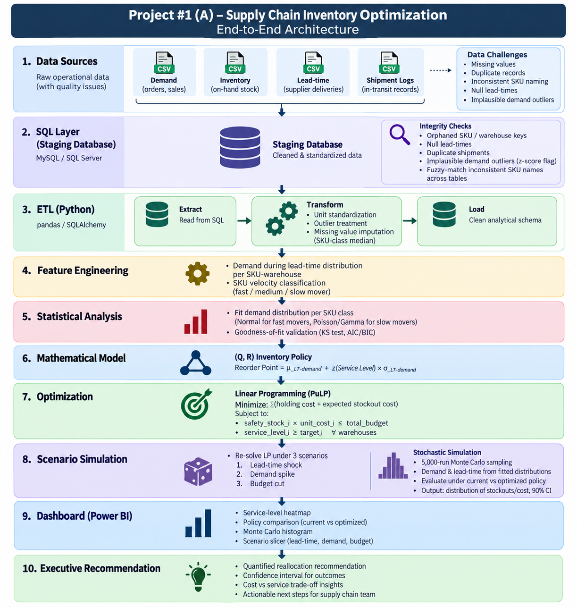

# Stochastic Safety-Stock & Distribution Network Optimizer (CPG Supply Chain)

**Business problem:** A CPG distributor's supply chain team is holding inventory reactively — some category-region pairs are over-buffered, others stock out — with no systematic way to size safety stock against actual demand and lead-time uncertainty. This project builds a data-driven, budget-constrained safety-stock policy that explicitly accounts for uncertainty, rather than relying on flat buffer rules.

**Headline result:** re-allocating a fixed safety-stock budget using a stochastic, optimization-based policy reduces expected stockout events by **24.3%** (from 73.6 to 55.7 per period, across 497 real category-region pairs), at a modest **+4.4% cost increase** — a quantified, explicit risk/cost trade-off rather than a "free" improvement.

---

## Architecture



Data Sources → SQL staging + integrity checks → ETL → Feature Engineering → Statistical distribution fitting → Mathematical (Q,R) model → Optimization → Scenario + Monte Carlo simulation → Power BI dashboard → Executive recommendation.

## Dataset

[DataCo Smart Supply Chain for Big Data Analysis](https://www.kaggle.com/datasets/shashwatwork/dataco-smart-supply-chain-for-big-data-analysis) (Kaggle) — ~180,500 order-line records. Raw data is not committed to this repo (file size); see `data/DescriptionDataCoSupplyChain.csv` for the column dictionary, and download the full dataset from the Kaggle link above to reproduce.

Modeling grain: **(product category, order region)**, treated as a SKU-warehouse pair — 691 combinations appear in the data; 497 have ≥8 weeks of order history and were retained for distribution fitting (194 were excluded as too sparse to model reliably — see `sql/02_integrity_checks.sql`, Check 7).

## Method

1. **SQL staging + data integrity checks** (`sql/`) — null profiling, duplicate detection, orphaned category mappings, implausible values, lead-time-deviation outliers, sparse-pair detection.
2. **ETL** (`notebooks/01_load_dataco.ipynb`) — loads the raw CSV, drops PII columns, stages into SQLite.
3. **Distribution fitting** — Normal for fast-moving pairs, Gamma for slow/medium movers, validated with a KS goodness-of-fit test.
4. **(Q,R) mathematical model** — reorder point = expected demand during lead time + safety stock, with safety stock derived from each pair's own demand and lead-time variance (`sigma_DLT`), not a flat buffer.
5. **Optimization** — a budget-constrained nonlinear program (`scipy.optimize`, SLSQP) allocates a fixed safety-stock budget across all 497 pairs to minimize true expected cost (holding cost + stockout cost, the latter computed via the standard Normal loss function). See the note below on why this replaced an earlier linear-programming (PuLP) attempt.
6. **Scenario + stochastic analysis** — 3 deterministic shocks (lead-time +30%, demand +25%, budget -20%) plus a 5,000-trial Monte Carlo simulation comparing the current flat-funding policy against the optimized policy, reported with 90% confidence intervals.
7. **Dashboard** — Power BI (`dashboard/dashboard.pbix`), built from the exported model outputs in `dashboard/powerbi_exports/`.

## A note on methodology (why this is worth reading)

The first version of the optimizer used a PuLP linear program with a linear approximation of stockout cost. That worked adequately on small synthetic test data, but when run against the real 497-pair dataset, it produced a result that was **worse than the naive baseline** (stockouts increased ~73%) — the linear approximation broke down under real-world cost and volume heterogeneity. This was caught by comparing the optimizer's output against a Monte Carlo simulation rather than trusting the optimizer's own "optimal" status flag, and fixed by replacing the linear proxy with the mathematically correct newsvendor-style formulation (the standard Normal loss function), solved as a nonlinear program. The corrected version is what's in this repo.

## Results

| Metric | Current policy (flat 60% funding) | Optimized policy |
|---|---|---|
| Expected stockout events/period | 73.6 (90% CI: 61-87) | 55.7 (90% CI: 44-67) |
| Expected cost/period | 2,016 (90% CI: 1,890-2,166) | 2,105 (90% CI: 1,998-2,242) |

**Recommendation:** adopt the optimized, budget-constrained safety-stock policy. It reduces expected stockouts by roughly a quarter at a ~4% cost premium — a favorable trade-off for a business prioritizing service level, and a transparent one for a business more cost-sensitive, since both sides of the trade-off are quantified with confidence intervals rather than presented as a single "the model says so" number.

## Repository structure

```
notebooks/    - 01_load_dataco.ipynb (ETL) + project_a_pipeline.ipynb (modeling, optimization, simulation, export)
sql/          - staging schema + integrity-check queries
dashboard/    - dashboard.pbix + the CSVs it's built from
documentation/- architecture diagram
presentation/ - executive client-deck (see note below)
data/         - column dictionary only (raw data not committed; see Kaggle link above)
```

## Status / what's pending
- [ ] Presentation deck (`presentation/`) — not yet added
- [ ] Power BI dashboard should be refreshed against the corrected `dashboard/powerbi_exports/pair_level_model_output.csv` (the committed `.pbix` may reflect an earlier, uncorrected optimizer run)
